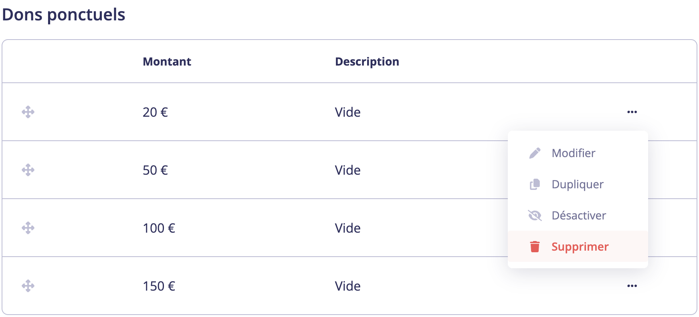
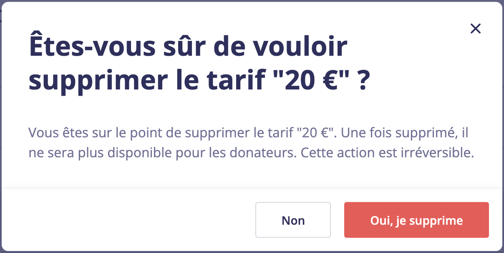
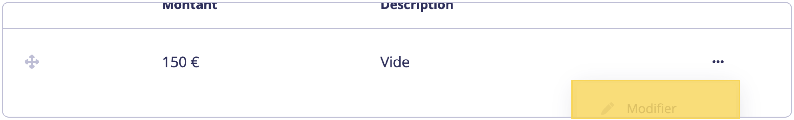
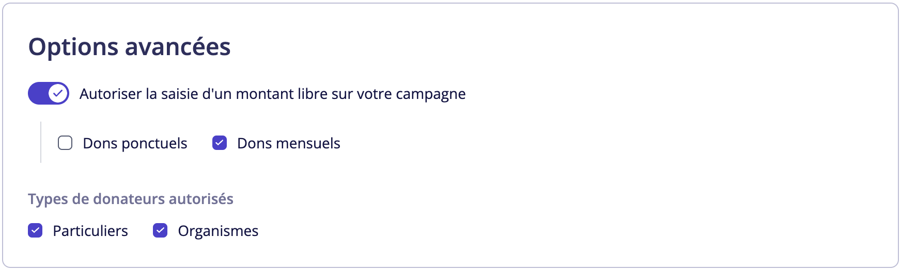
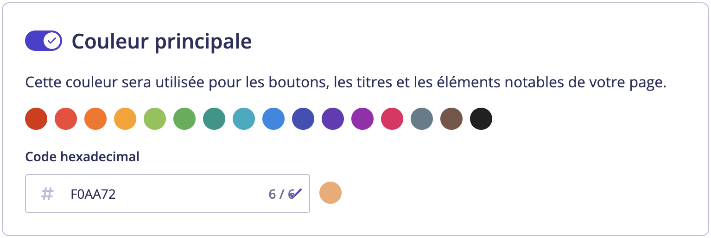
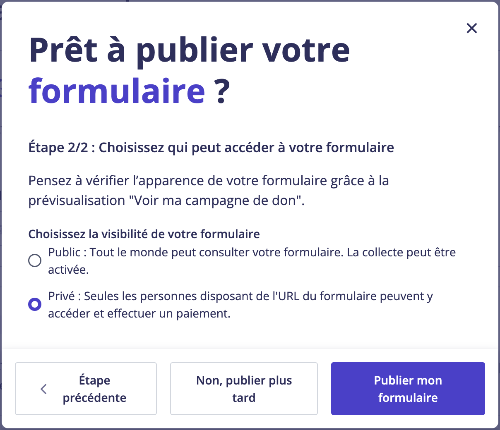

# 📋 Créer une campagne de don mensuel sur HelloAsso

HelloAsso vous permet de créer une campagne de don qui accepte exclusivement des dons mensuels. Suivez les étapes suivantes pour en mettre un en place, que vous pourrez ensuite lier à votre budget mensuel pour inciter les donateurs à vous faire un don mensuel.

## Créer une nouvelle campagne de don

1. Connectez vous à votre compte [HelloAsso](https://auth.helloasso.com/connexion?redirect=https://www.helloasso.com/utilisateur/redirection-backoffice&back=https://www.helloasso.com/).

1. Dans votre compte administrateur, utilisez le menu à gauche pour naviguer sur la page **Mes dons**

   

1. Cliquer sur **Créer une campagne de don**

   

## Information générales

1. Nomer le formulaire de don
   :::tip
   **Nom public**

   Nous recommendons aux sanctuaire de nomer ce formulaire `Devenez un gardien en or` car les donateurs qui mettent en place un don mensuel via Sanctopia gagnerons le titre de guardien en or du sanctuaire. En utilisant le même language, l'expérience utilisateur est clair.

   **Nom privé**   

   Vous êtes libre de choisir le nom privé de vos campagnes de dons, mais nous recommendons que vous précisiez que c'est pour Sanctopia pour vous aider à différencier entre les campagnes propre à Sanctopia, et les autres qui seront utiliser en dehors de Sanctopia.
   :::
   

1. Cliquer sur **Enregistrer et passer à l’étape suivante**

## Montants des dons

1. Supprimer tous les dons ponctuels dans la liste de nomée **Dons ponctauels** en cliquant sur le 3 petits points `...` qui se trouvent sur la droite de chacun des montants, puis en cliquant sur **Supprimer**

   

   Confirmer pour chaque don ponctuel en cliquant sur **Oui, je supprime**
   


   :::warning
   Au moment ou nous écrivons notre documention, il y a un bug lorsqu'il n'y a plus que quelques montants dans la liste de dons ponctuels. Le menu est coupé et le bouton **Supprimer** est caché. Il suffit de scroll vers le pas pour faire apparaitre le reste du menu

   
   :::

1. Assurer que l'option **Dons ponctuels** est décochée dans les **Paramètres** si vous souhaitez **Autoriser la saisie d'un montant libre sur votre campagne**

   

:::danger
Avant d'appuyer sur **Enregister et passer à l'étape suivante** sur la page **Montants des dons**, assurez vous que vous avez bien:

- [ ] Supprimé tous les dons ponctuels
- [ ] Décoché l'option **Dons ponctuels** dans les paramètres

Nous avons eu des problèmes lorsque nous avons essayé de changer ces options dans des campagne de dons existantes, donc une fois sauvegarder, il est possible que vous ne serez pas capable de faire en sorte que votre campagne autorise exlusivement les dons mensuels
:::

## Informations complémentaires

1. Ajouter le champ **Code PIN Sanctopia** ([Suivez les étapes 5 et 6 dans la section **Ajouter un champs Code PIN Sanctopia à vos formulaires**](../HelloAsso/formulaires-compatible) si vous avez oublié comment faire)

1. Cliquer sur **Enregister et passer à l'étape suivante**

## Personnalisation

### Couleur principale

1. Sanctopia souhaite offrice une expérience utilisateur unique et intuitive. Lors de la création de campagnes de dons qui seront exclusivement utilisées sur Sanctopia, nous demandons aux sanctuaires que leur formulaire aient la même couleur que le thème utilisé sur notre plateforme:
   ```
   F0AA72
   ```

   

1. Cliquer sur **Publier maintenant**

## Prêt à publier votre formulaire ?

### Choisissez le design de votre formulaire

1. HelloAsso va vous demander quel design vous voulez pour votre formulaire. Cette étape n'a pas d'importance. Cliquer sur **Enregister**

### Choisissez qui peut accéder à votre formulaire

1. Selectionner l'option **Privé : Seules les personnes disposant de l'URL du formulaire peuvent y accéder et effectuer un paiement.** 

   

1. Cliquer sur **Publier mon formulaire**

## Prêt pour être intégré avec Sanctopia

Maintenant que vous avez une campagne de don qui accepte que des dons mensuels, vous être prêt à connecter ce formuaire à votre budget mensuel sur Sanctopia !