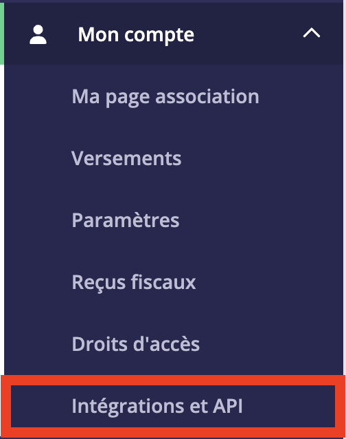
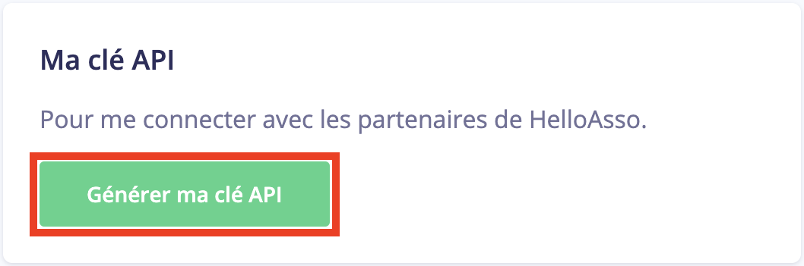
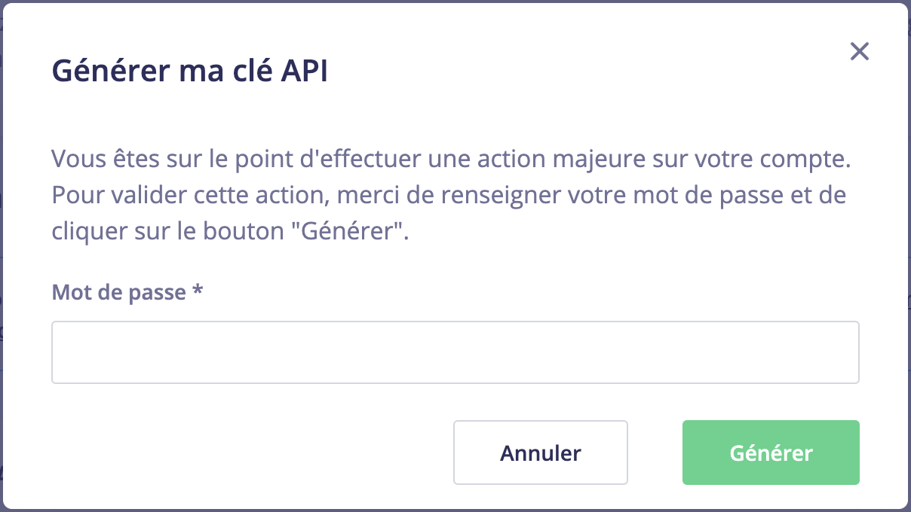
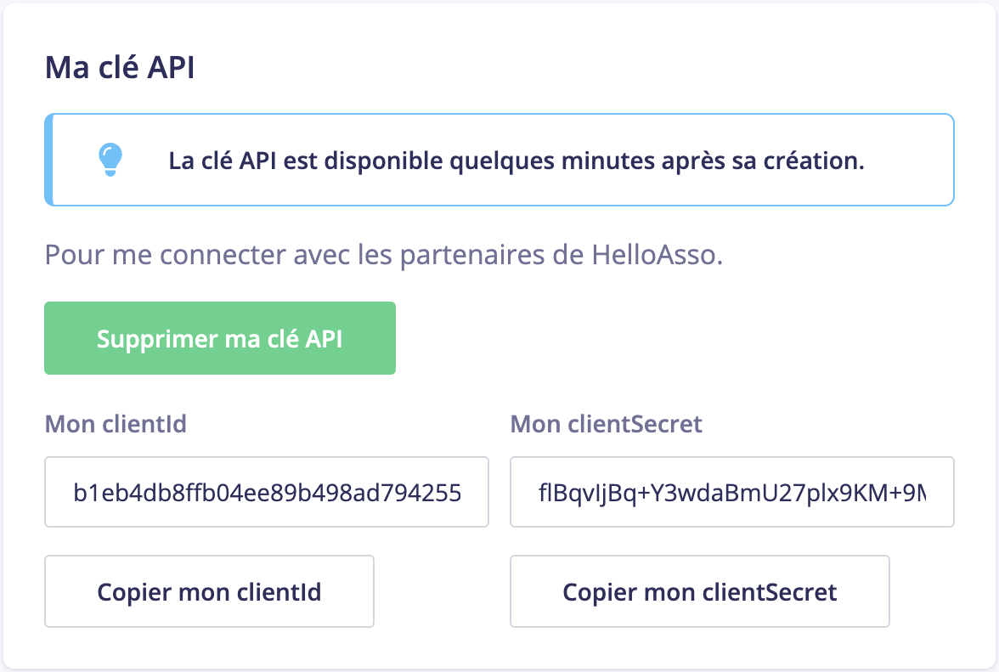
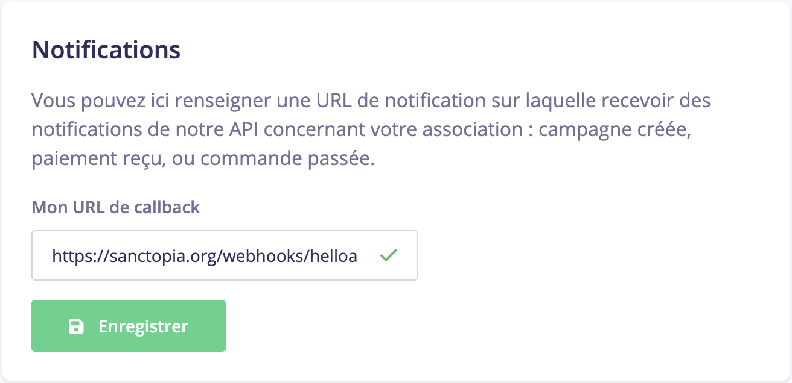

# Connecter votre compte HelloAsso

HelloAsso vous permet de connecter votre compte avec d'autres services comme Sanctopia. Notre plateforme a besoin de deux choses:

1. **Clé API**

   Celle-ci permet à Sanctopia d'accéder vos formulaires de dons pour que vous puissier les liers aux animaux et permettre à vos donateurs de venir des gardiens.

1. **Notifications**

   Un lien que vous donnez à HelloAsso pour qu'ils envoient des notifications quand des événement se passe sur votre compte. Par example, lors de la création de nous formulaires de dons, ou quand vous recevez un nouveau don. Celà permet à Sanctopia de savoir automatiquement quand un donateur vous fait un don directement à travers notre plateforme.

Sans ces deux items, Sanctopia ne peut pas fonctionner.

## 🔑 Générer un clé API

1. Connectez vous à votre compte [HelloAsso](https://auth.helloasso.com/connexion?redirect=https://www.helloasso.com/utilisateur/redirection-backoffice&back=https://www.helloasso.com/).

1. Dans votre compte administrateur, utilisez le menu à gauche pour naviguer sur la page **Mon compte > Intégrations et API**

   

1. Cliquer sur **Génerer ma clé API**
  
   

1. Confirmer la création de cette clé avec votre mot de passe HelloAsso _(celui que vous avez utilisé pour vous connécter)_. Cliquer sur **Générer**.

   

1. Votre clé API a été crée. Vous avez maintenant accès à deux valeurs: `clientId` et `clientSecret`

   

   :::danger
   Ne partagez pas votre `clientId` et `clientSecret` avec d'autres personnes.
   :::
   
   :::info
   Sanctopia ne sauvegardera jamais votre `clientId` et `clientSecret`. Ces données seront utilisées qu'une seule fois pour générer un token qui nous permettra d'intéragir avec HelloAsso.
   :::

1. Connecter votre compte HelloAsso avec Sanctopia

## 🔔 Notifications

Toujours sur la même page **Mon compte > Intégrations et API**, ajoutez le lien suivant comme votre **URL de callback**:

```
https://sanctopia.org/webhooks/helloasso
```



Cliquer sur **Enregistrer**