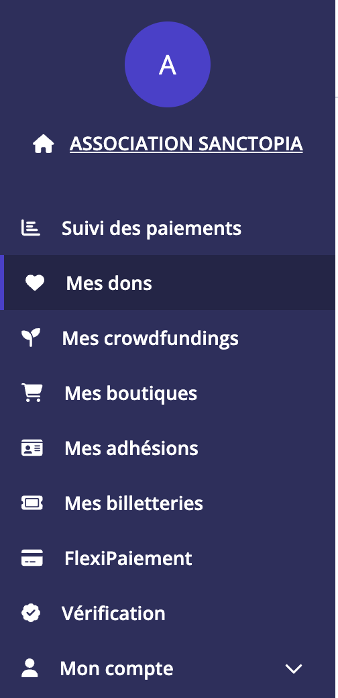
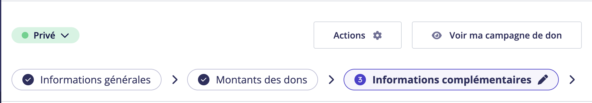
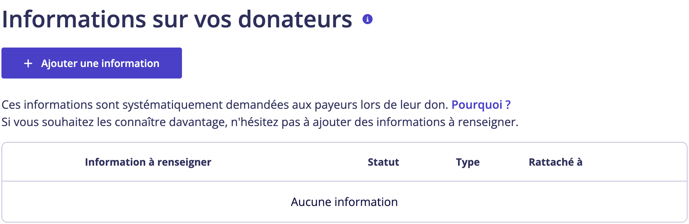
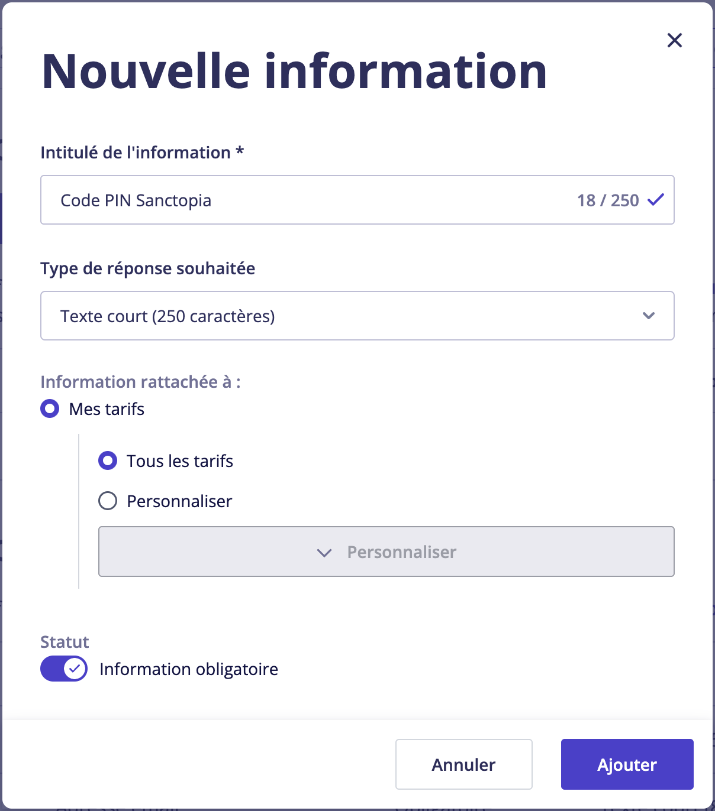
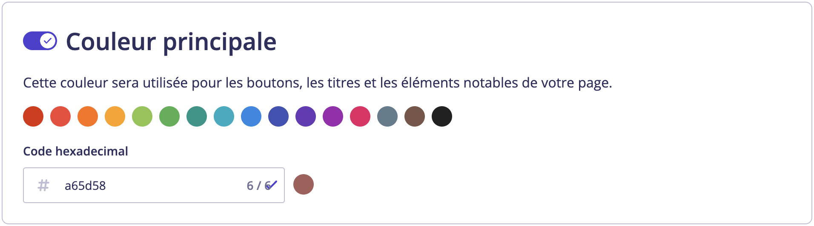

# 📋 Créer une campagne de don compatible avec Sanctopia

## 🧑‍🏫 Comment ça marche ?

Pour que Sanctopia puisse reconnaître les dons faits à travers sa plateforme, et pour récompenser les donateurs, il est nécessaire que les formulaires contiennent des **informations complémentaires**.

Lorsqu'un donateur souhaite faire un don, Sanctopia génère automatiquement un **code PIN** que le donateur devra ajouter au formulaire de don.

Pour qu'un formulaire de don soit compatible avec Sanctopia, il est nécessaire que les formulaires de dons puissent permettre aux donateurs d'entrer leur code PIN qui leur sera donné lors de la complétion du formulaire HelloAsso.

:::danger
Sans la possibilité d'entrer leur **Code PIN Sanctopia**, il nous sera impossible de lier les dons à notre plateforme.
:::

## ✏️ Ajouter un champ **Code PIN Sanctopia** à vos formulaires

:::warning
Une fois que vous créez une campagne de don avec le champ **Code PIN Sanctopia**, il est possible qu'HelloAsso ajoute automatiquement ce champ à la prochaine campagne de don que vous créerez. Assurez-vous de supprimer ce champ quand vous créez de nouvelles campagnes de dons qui seront utilisées en dehors de la plateforme Sanctopia.
:::

### Accéder à une campagne de don

1. Connectez-vous à votre compte [HelloAsso](https://auth.helloasso.com/connexion?redirect=https://www.helloasso.com/utilisateur/redirection-backoffice&back=https://www.helloasso.com/).

1. Dans votre compte administrateur, utilisez le menu à gauche pour naviguer vers la page **Mes dons**

   

1. Cliquez sur **Créer une campagne de don** (ou **Administrer** sur une campagne de don existante)

   

### Informations complémentaires

1. Naviguez dans la section **Informations complémentaires**

   

1. Cliquez sur **Ajouter une information** dans la section **Informations sur vos donateurs**

   

1. Remplissez le formulaire avec les informations suivantes et cliquez sur **Ajouter** :

   - Intitulé de l'information : **Code PIN Sanctopia**
   - Type de réponse souhaitée : **Texte court (250 caractères)**
   - Information rattachée à :
     - **Mes tarifs**
       - **Tous les tarifs**
   - Statut : **✓ Information obligatoire** _(Doit être cochée)_

   

   :::warning
   Il est important que ce formulaire soit rempli exactement comme ceci. Si votre formulaire est utilisé autre part que sur Sanctopia, il est recommandé de **décocher le statut Information obligatoire**.
   :::

   :::tip
   Il est recommandé de créer des campagnes de dons qui seront uniques à Sanctopia et qui resteront privées pour qu'elles ne soient pas listées sur votre page HelloAsso et éviter leur partage en dehors de Sanctopia.
   :::

### Personnalisation

#### Couleur principale

Sanctopia souhaite offrir une expérience utilisateur unique et intuitive. Lors de la création de campagnes de dons qui seront exclusivement utilisées sur Sanctopia, nous demandons aux sanctuaires que leur formulaire ait la même couleur que le thème utilisé sur notre plateforme :

```
F0AA72
```

