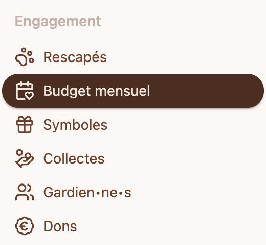
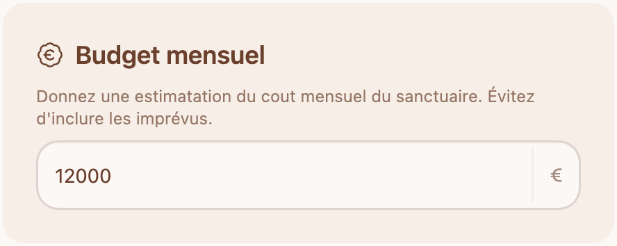
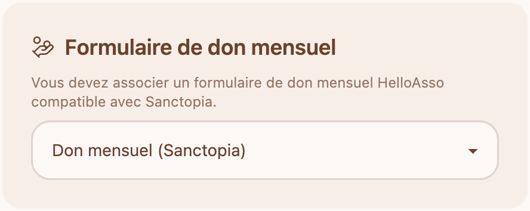

# 💸 Ajouter un budget mensuel sur Sanctopia

Un budget mensuel agit comme une cagnotte dynamique en temps réel. Cette cagnotte calcule le montant total des dons mensuels de votre sanctuaires et le compare à votre budget.

Accèder à votre budget mensuel via le menu de navigation **Budget mensuel**

## 💶 Budget mensuel

Ajoutez une estimation du cout mensuel de votre sanctuaire. Le montant qui vous permettrai de garder votre sanctuaire ouvert, et prendre soin de vos rescapés.

## Formulaire de don mensuel

Pour inviter vos donateur à vous faire un don mensuel, nous recommendons d'attacher un formulaire de don qui permet uniquement de mettre en place un don mensuel.
Suivez les instructions ici pour créer une campagne de don mensuel : [Campagne de don mensuel](/Sanctuaires/budget-mensuel/campagne-de-don-mensuel)

Une fois que votre campagne de don mensuel est créée, elle apparaitra dans votre liste de formulaires de don.

