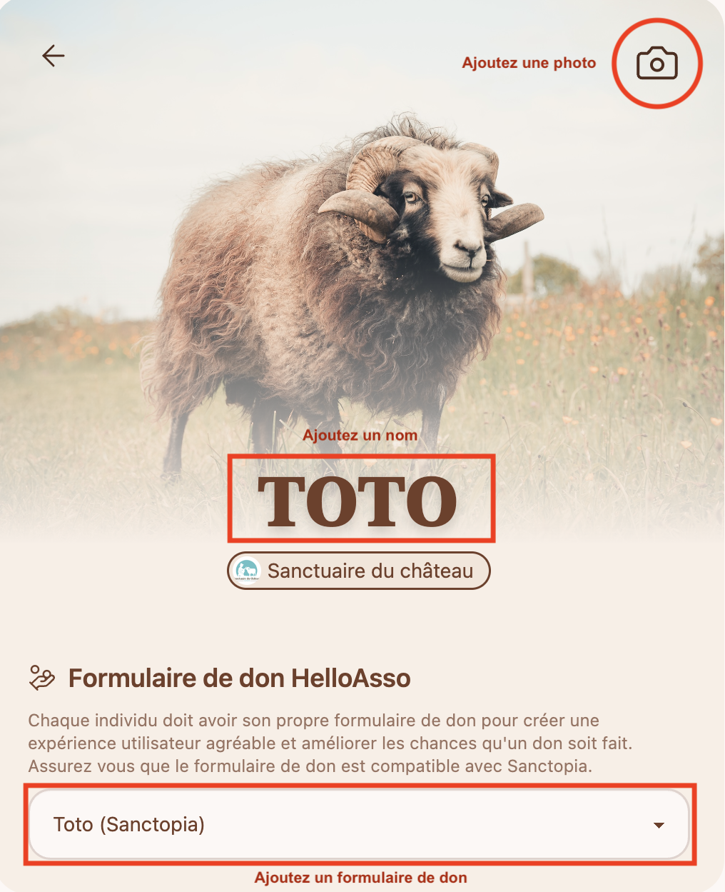
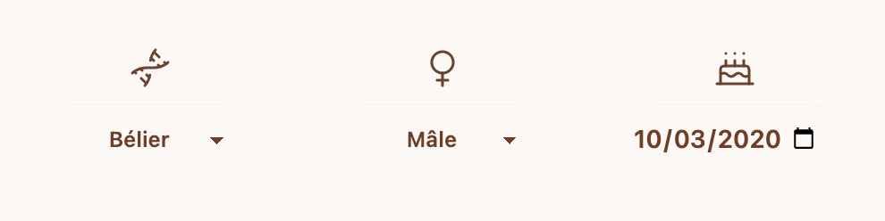
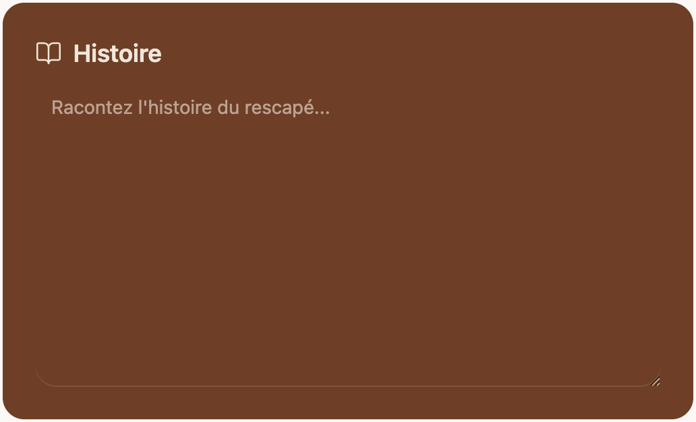
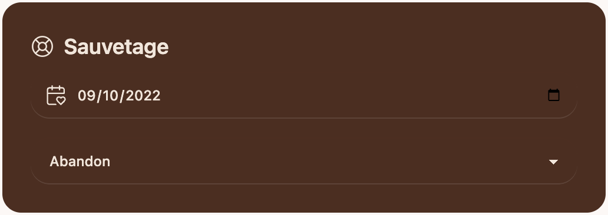
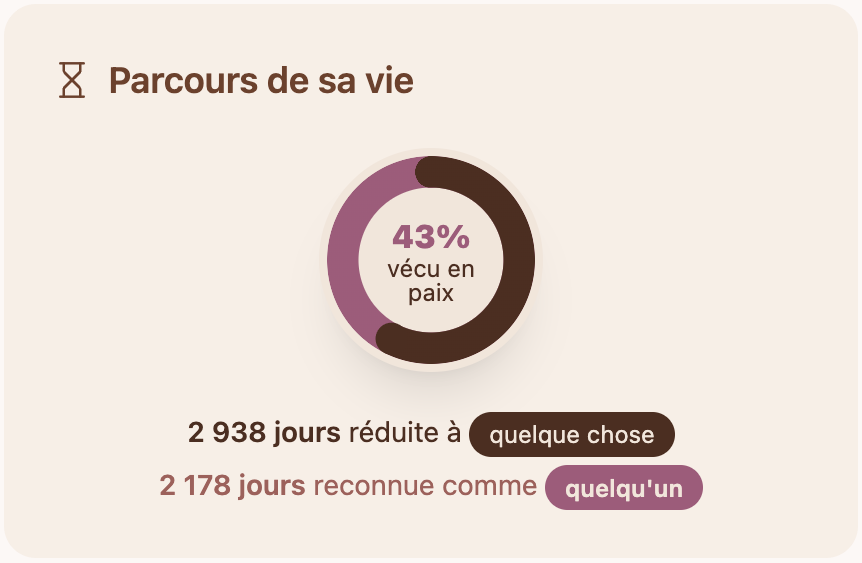

# 🐰 Ajouter un·e rescapé·e

Les profils des vos rescapé·e·s peuvent être riche en information. Le plus d'information vous partagez, le plus le public peut se sentir proche de votre protégé.

## Les bases

Chaque rescapé doit au moins avoir un nom, une photo, et un formulaire de don.

1. **Photo**

   La photo doit montrer l'individu pour qu'il/elle soit reconnaissable.

2. **Nom**

   Le nom du rescapé doit être unique.

3. **Formulaire de don**

    Choisissez un formulaire de don créé spécifiquement pour ce rescapé. Celui-ci permettra aux donateurs/donatrices de faire un don envers cet individu.

## Date de naissance, espèce et sex

Le plus de détails vous offrez, le plus vous permettez à Sanctopia d'enrichir le profil du rescapé. Par example, l'espèce permettra d'associer votre rescapé à des symboles que les donateurs pourront collection, les incitants à donner.

:::tip
Ajouter une espèce permet à Sanctopia d'offrir plus d'information, et envoyer des symboles à ceux et celles qui choisissent de s'engager auprès de votre rescapé. 

_N'hésitez surtout pas à nous contacter si vous ne trouvez pas une espèce pour votre rescapé. Nous l'ajouterons dès que possible._
::::

## Personnalité

Décrivez la personnalité de l'individu du mieux que vous pouvez. Donnez assez de détails pour donner envie d'en apprendre plus, mais évitez d'écrire un roman.

## Histoire

Expliquez plus spécifiquement leur histoire. Si vous donnez l'industrie d'où ils ont été sauvés, Sanctopia ajoutera un résumé de pratiques courantes. La section "histoire" est l'opportunité de rendre leur histoire unique.

## Sauvetage

:::tip
Ajouter un type d'exploitation permet à Sanctopia d'offrir plus d'information, et envoyer des symboles à ceux et celles qui choisissent de s'engager auprès de votre rescapé. 

_N'hésitez surtout pas à nous contacter si vous ne trouvez pas une catégorie pour votre rescapé. Nous l'ajouterons dès que possible._
::::

## Parcours de sa vie

Si vous donnez une **date de naissance** et la **date de sauvetage**, Sanctopia sera capable de calculer le nombre de jours que votre rescapé a vécu exploité, et le nombre de jours vécu en (semi) liberté. Ça permet au public de visualiser le parcours de leur vie.

