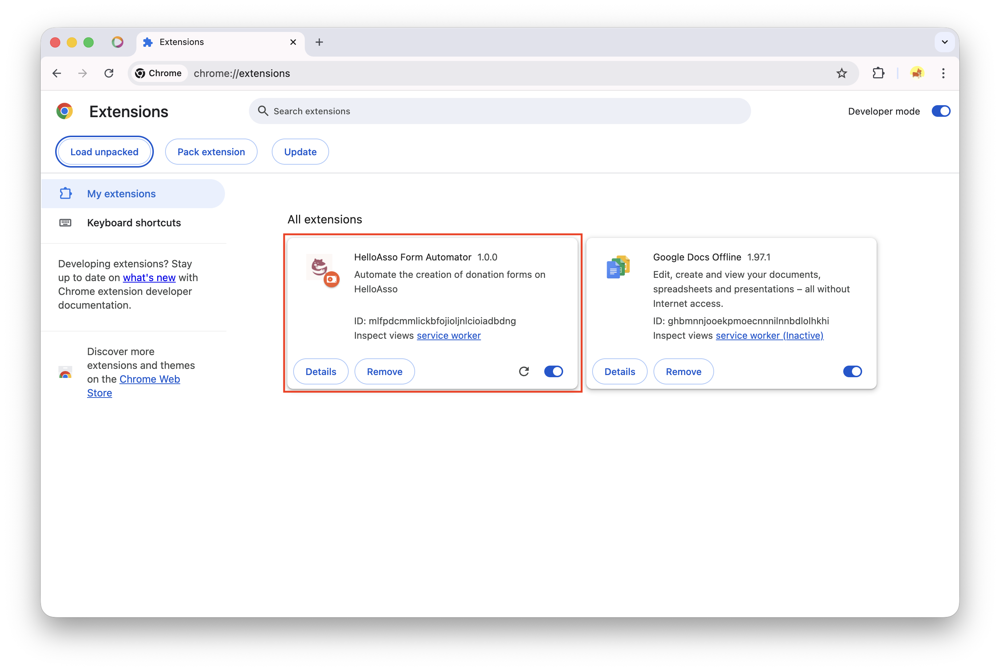

Cette extension pour Google Chrome a été créée pour ajouter automatiquement plusieurs dons ponctuels à des formulaires existants, et pour appliquer la palette de couleurs de Sanctopia aux formulaires qui seront affichés sur la plateforme.

## Comment ça marche ?

Cette extension reproduit automatiquement les étapes qui devraient être effectuées manuellement. Au lieu de cliquer sur les boutons et de remplir les valeurs vous-même, l'extension le fait automatiquement et plus rapidement.

## Installer l'extension

### Télécharger l'extension

Vous pouvez télécharger l'extension via ce lien : [https://github.com/sanctopia/sanctopia_helloasso_extension/releases/tag/v0.1.0](https://github.com/sanctopia/sanctopia_helloasso_extension/releases/tag/v0.1.0)

Cliquez sur **sanctopia_extension-v0.1.0.zip** en bas de la page.

### Extraire l'extension

Le fichier téléchargé est un fichier zip qu'il faut décompresser pour accéder à l'extension.

#### Mac

Sur Mac, double-cliquez sur le fichier `sanctopia_extension-v0.1.0.zip`.

Un dossier `sanctopia_extension` sera créé.

#### Windows

Sur Windows, faites un clic droit sur le fichier `sanctopia_extension-v0.1.0.zip`, puis sélectionnez **Extraire tout...**.

Une fenêtre s'ouvrira pour choisir l'emplacement d'extraction. Cliquez sur **Extraire**.

Un dossier `sanctopia_extension` sera créé.

### Installer l'extension dans Chrome

1. Dans Google Chrome, ouvrez le menu en cliquant sur les 3 points verticaux en haut à droite, puis cliquez sur **Extensions > Gérer les extensions**.

  

  Ou entrez cette adresse : `chrome://extensions/`

2. Dans la fenêtre "Mes extensions", en haut à droite, activez le **Mode développeur**.

  

3. En haut à gauche, cliquez sur **Charger l'extension non empaquetée**.

  

4. Sélectionnez le dossier de l'extension que vous avez précédemment téléchargé et décompressé.

  

5. L'extension **HelloAsso Form Automator** devrait maintenant apparaître dans la liste.

  

### Utiliser l'extension

1. Sur HelloAsso, accédez à la page **Mes dons**.

  

2. En haut à droite, cliquez sur l'icône des extensions, puis sélectionnez **HelloAsso Form Automator**.

  

3. Cliquez sur **Charger les campagnes**. Toutes les campagnes visibles sur la page s'afficheront. Sélectionnez celles auxquelles vous souhaitez ajouter des dons ponctuels.

4. Ajoutez les montants souhaités. Par défaut, vous verrez `20,50,100,150`, ce qui ajoutera les dons ponctuels **20 €**, **50 €**, **100 €** et **150 €**.

5. Choisissez le don à afficher comme **Populaire** (par défaut : **50 €**).

6. Cliquez sur **Ajouter les dons ponctuels**.

### Patientez...

La page se rafraîchira automatiquement, comme si quelqu'un contrôlait votre navigateur. C'est l'extension qui effectue le travail à votre place.

**Important :** Ne fermez pas Chrome. Une fois le processus terminé, vous serez automatiquement redirigé vers la page **Mes dons**.