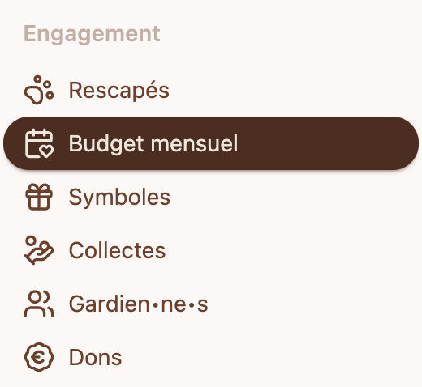
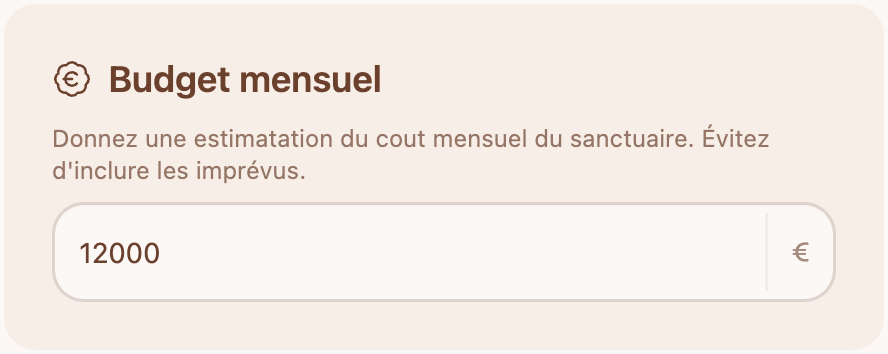
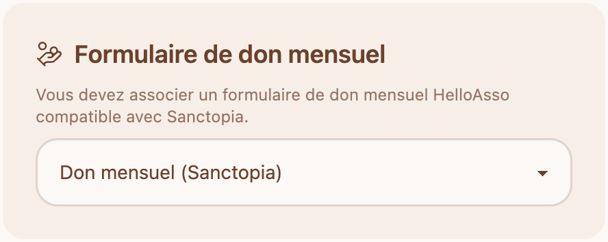

# 💸 Ajouter un budget mensuel sur Sanctopia

Un budget mensuel agit comme une cagnotte dynamique en temps réel. Cette cagnotte calcule le montant total des dons mensuels de votre sanctuaire et le compare à votre budget.

Accèder à votre budget mensuel via le menu de navigation **Budget mensuel**

## 💶 Budget mensuel

Ajoutez une estimation du coût mensuel de votre sanctuaire. Le montant qui vous permettrait de garder votre sanctuaire ouvert et de prendre soin de vos rescapés.

## Formulaire de don mensuel

Pour inviter vos donateurs à vous faire un don mensuel, nous recommandons d'attacher un formulaire de don qui permet uniquement de mettre en place un don mensuel.
Suivez les instructions ici pour créer une campagne de don mensuel : [Campagne de don mensuel](./campagne-de-don-mensuel)

Une fois que votre campagne de don mensuel est créée, elle apparaîtra dans votre liste de formulaires de don.

