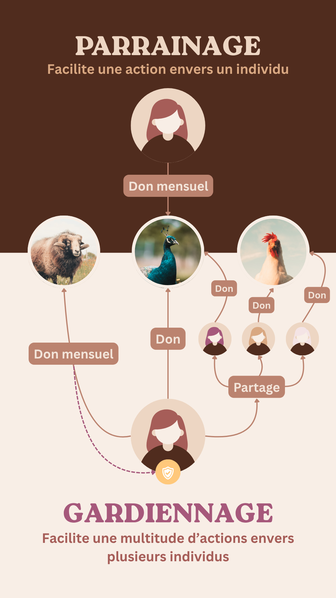
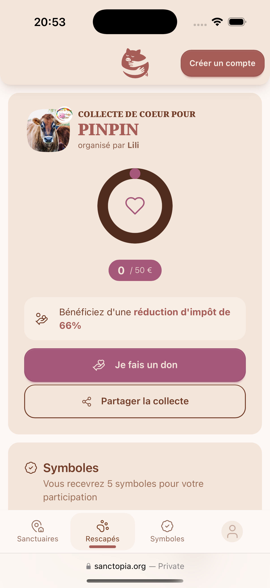
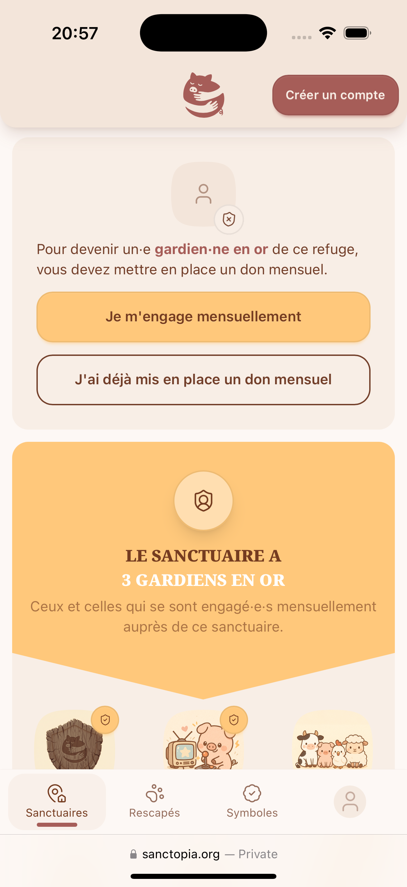

# 🛡️ Gardiennage

## Parrainage vs Gardiennage

### Parrainage
Le parrainage est l'une des stratégies les plus efficaces pour encourager l'engagement auprès d'un sanctuaire. Il consiste à soutenir financièrement un·e rescapé·e spécifique, généralement par un don mensuel récurrent.

### Gardiennage
Le gardiennage est une évolution du parrainage traditionnel. Ce système encourage un engagement plus profond et diversifié, allant au-delà du simple soutien financier. Le titre de gardien·ne est attribué aux personnes démontrant une implication active — par le don, le partage ou d'autres formes de soutien — et qui reçoivent les outils nécessaires pour développer leur engagement auprès d'un ou plusieurs rescapés.

## Les Facettes du Gardiennage

Sanctopia privilégie une stratégie de gardiennage pour encourager les utilisateurs à découvrir et soutenir plusieurs individus au sein d'un sanctuaire. Cette approche permet d'explorer diverses espèces, personnalités et histoires.

Nous souhaitons aussi valoriser le partage. Nous trouvons le parrainage trop isolé, n'incitant pas à faire découvrir les rescapés à son entourage.

### L'Engagement par le Partage

Pour devenir gardien·ne d'un rescapé, l'utilisateur doit contribuer un don de 5 €, ou solliciter ce don auprès de son entourage. Sanctopia souhaite rendre l'engagement accessible à tous, en offrant des alternatives au don financier direct.

Concrètement, un utilisateur peut devenir gardien·ne de tous les rescapés de Sanctopia sans dépenser un centime, simplement en partageant son lien unique auprès de son réseau ou via ses propres campagnes.

Une fois le statut de gardien·ne obtenu, l'utilisateur peut collecter des cœurs d'une valeur de 50 €. Ces cœurs sont des mini-cagnottes que chaque gardien·ne peut utiliser pour récolter des cœurs pour les rescapés qu'il·elle soutient.

### L'Engagement Mensuel

Idéalement, les utilisateurs qui le peuvent sont encouragés à mettre en place un don mensuel. Pour valoriser cet engagement régulier, Sanctopia décerne le titre de **gardien·ne en or** aux donateurs mensuels du sanctuaire.

Le titre de gardien·ne en or n'est offert qu'aux utilisateurs qui mettent en place un don mensuel eux-même.

