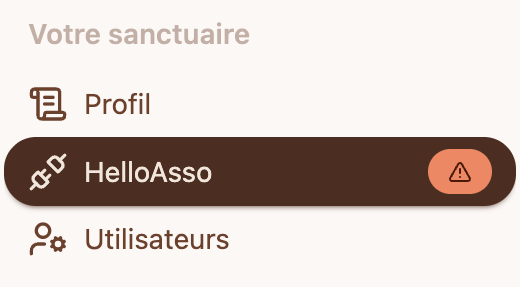
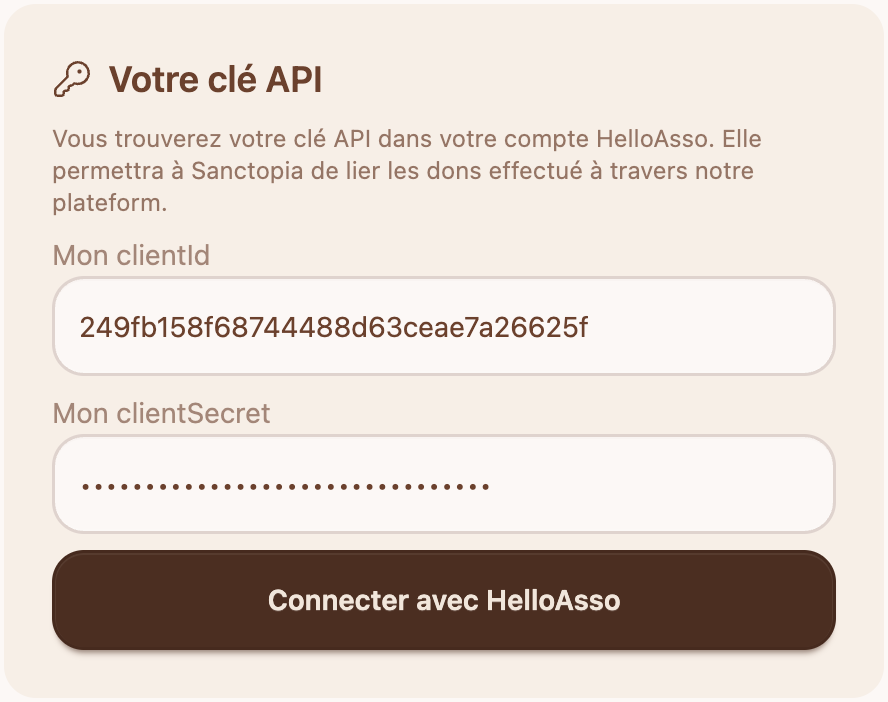

# 🔌 Connecter votre compte HelloAsso sur Sanctopia

## 🔑 Ajoutez votre clé API

1. Depuis l'interface de gestion de votre sanctuaire, naviguez dans la section **HelloAsso** depuis le menu

   

1. Ajoutez votre **clientId** et **clientSecret** que vous trouvez sur votre compte associatif HelloAsso. Suivez les instruction ici : [Créer une clé API sur HelloAsso](./creer-une-cle-api)

   

1. Cliquez sur **Connecter avec HelloAsso**