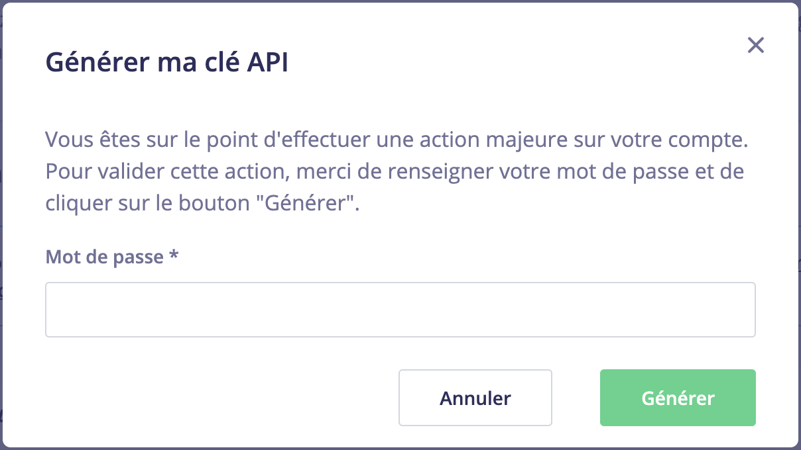
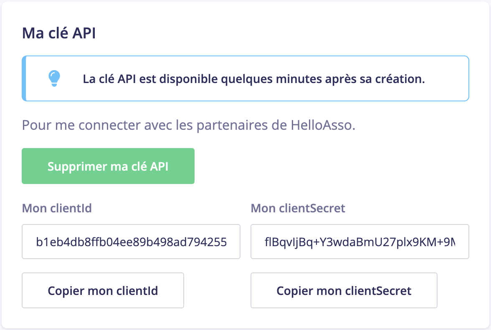

# 🔑 Créer une clé API sur HelloAsso

Une clé API permet à Sanctopia d'accéder à vos formulaires de dons pour que vous puissiez les lier aux rescapés et permettre à vos donateurs de devenir des gardiens.

## Accéder à la page Intégrations et API

1. Connectez-vous à votre compte [HelloAsso](https://auth.helloasso.com/connexion?redirect=https://www.helloasso.com/utilisateur/redirection-backoffice&back=https://www.helloasso.com/).

1. Dans votre compte administrateur, utilisez le menu à gauche pour naviguer vers la page **Mon compte > Intégrations et API**

   

## Générer une clé API

1. Cliquez sur **Générer ma clé API**

   

1. Confirmez la création de cette clé avec votre mot de passe HelloAsso _(celui que vous avez utilisé pour vous connecter)_. Cliquez sur **Générer**.

   

1. Votre clé API a été créée. Vous avez maintenant accès à deux valeurs : `clientId` et `clientSecret`

   

:::danger
Ne partagez pas votre `clientId` et `clientSecret` avec d'autres personnes.
:::

:::info
Sanctopia ne sauvegardera jamais votre `clientId` et `clientSecret`. Ces données ne seront utilisées qu'une seule fois pour générer un token qui nous permettra d'interagir avec HelloAsso.
:::
