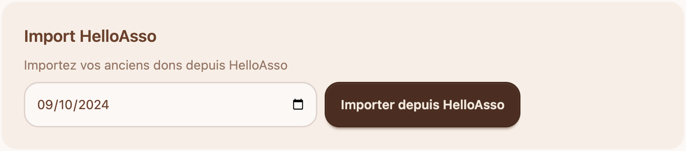

# 📊 Importer l'historique de dons

HelloAsso vous permet de voir l'historique de vos dons, mais ne permet pas de les visualiser. Sanctopia vous permet de visualiser l'état de vos dons et votre progression.

Il y a deux avantages d'importer l'historique de vos dons :

1. Si vous avez mis en place un budget mensuel, Sanctopia montrera l'état de votre cagnotte mensuelle immédiatement, au lieu de devoir attendre 1 mois.
2. Vos donateurs/donatrices qui ont déjà fait un don via HelloAsso pourront lier leurs dons précédents avec leur compte Sanctopia. Ceci leur permettra de voir les dons qu'ils vous ont déjà faits, mais aussi recevoir le titre de **gardien en or** s'ils ont déjà mis en place un don mensuel.

## 💾 Démarrer un import

1. Naviguez sur la page de dons à travers la barre de navigation
   

2. Dans la section **Import HelloAsso**, choisissez une date, puis cliquez sur **Importer depuis HelloAsso**
   

   Sanctopia vous laisse choisir depuis quelle date vous souhaitez que cet historique soit importé. Par défaut, Sanctopia sélectionne un import des paiements d'un an, mais vous pouvez remonter plus loin si vous le souhaitez.

:::warning
L'import des paiements peut prendre quelques minutes ou quelques heures. Cela dépend du nombre de dons que vous avez reçus durant cette période.
:::