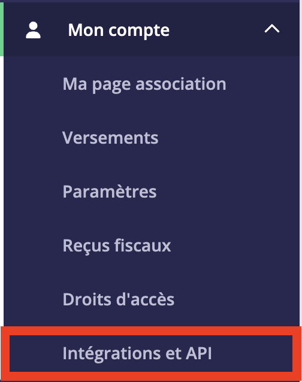
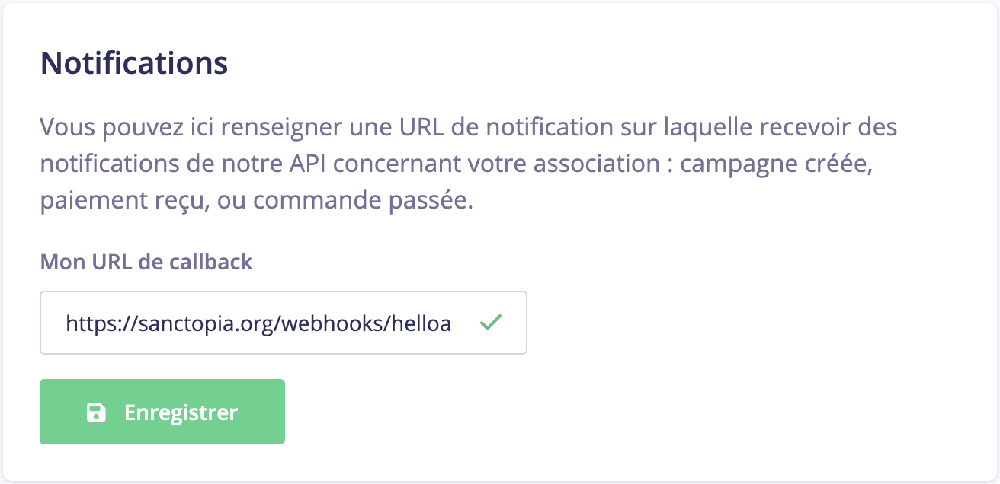

# 🔔 Permettre Sanctopia d'être notifié par HelloAsso

Sanctopia a besoin de savoir quand un don a été fait sur HelloAsso. Cela nous permet de récompenser automatiquement et en temps réel les donateurs lorsqu'ils vous ont fait un don.

## Accéder à la page Intégrations et API

1. Connectez-vous à votre compte [HelloAsso](https://auth.helloasso.com/connexion?redirect=https://www.helloasso.com/utilisateur/redirection-backoffice&back=https://www.helloasso.com/).

1. Dans votre compte administrateur, utilisez le menu à gauche pour naviguer vers la page **Mon compte > Intégrations et API**

   

## Notifications

1. Ajoutez le lien suivant dans **Mon URL de callback** :

   ```
   https://sanctopia.org/webhooks/helloasso
   ```

   

1. Cliquez sur **Enregistrer**